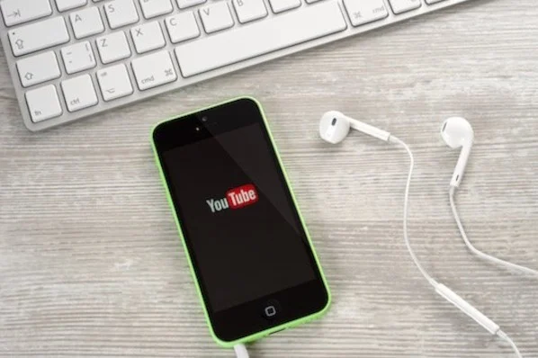

If you're reading this article, I probably don't need to tell you that video content accounts for over 74% of all online traffic, or that over five billion YouTube videos are watched every single day.

You already know video is an important channel, and you're ready to start leveraging YouTube for your own business. I'm here to show you how to do it.

This article will cover everything you need to know about creating a YouTube channel, so you can start uploading your own videos and growing your audience today.

## How to Make a YouTube Channel

1. Sign in to your Google account (or register and sign in if you don't have one).
2. Create a new YouTube channel using your Google account.
3. Navigate to the Customize Channel page.
4. Add Basic Info to your channel for discoverability.
5. Upload branding elements to your channel.
6. Customize your more advanced layout options.
7. Add videos and optimize them for search.

### Can't create a new channel?

If you're seeing a "This action isn't allowed" message when you try to create your channel, you may be using an outdated version of the YouTube app.

Here are your options to move forward:

1. Update the YouTube app on your device.
2. Create your YouTube channel using a browser on your PC (following the steps outlined in more detail below).
